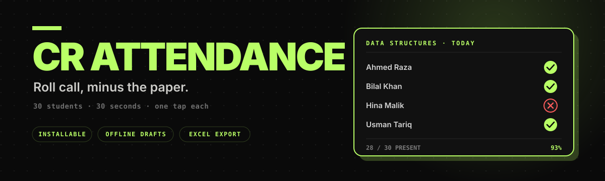
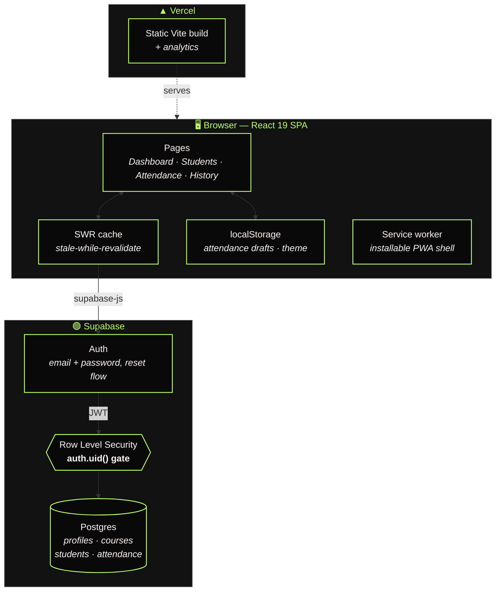
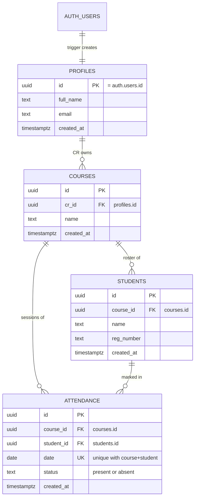
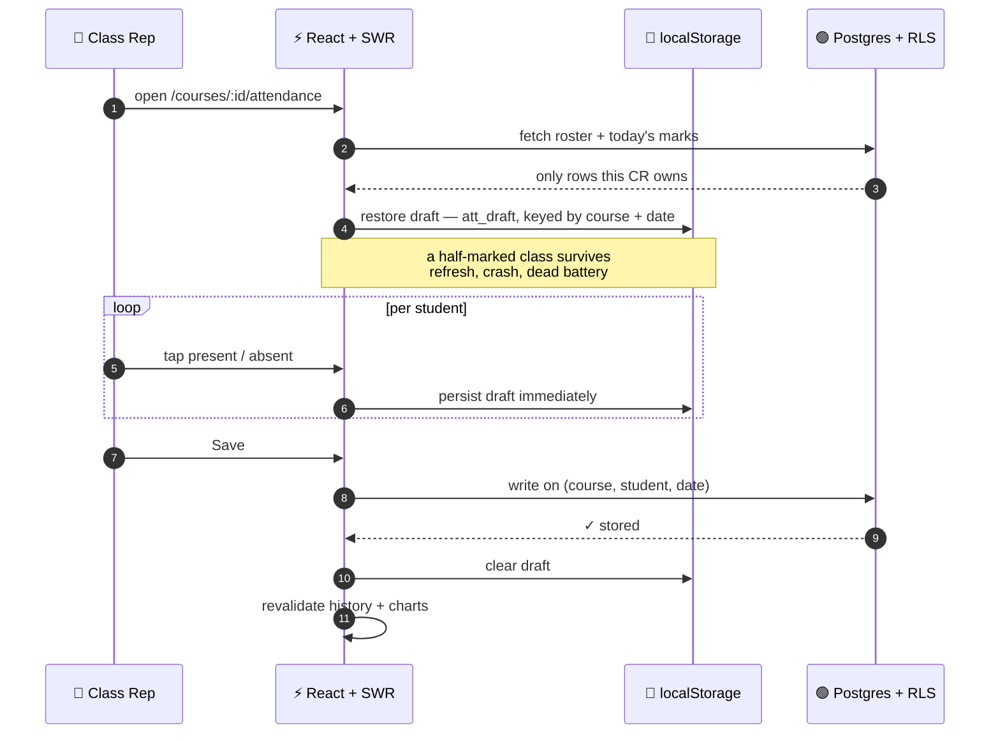

<div align="center">



<br/><br/>

**A class-representative attendance system built for a phone, in a corridor, with one bar of signal.**<br/>
Mark a class in thirty seconds. Import the roster from Excel. Export a report your teacher will actually accept.

<br/>

[](https://crattendanceapp.vercel.app)


<br/>

</div>

> **The problem.** Every class rep keeps attendance in a notebook, a WhatsApp thread, or a spreadsheet that lives on one laptop. At the end of the semester somebody has to turn forty scribbled columns into a percentage table — an afternoon of work and a guaranteed argument.
>
> **This.** Tap names. Everything downstream is already done.

<br/>

---

<!-- ─────────────────────────────────────────────────────────────
     SCREENSHOTS — drop PNGs into screenshots/ and uncomment.
     Capture at ~390px wide; this is a phone-first app.

| Dashboard | Marking |
|---|---|
|  |  |

| History & charts | Excel import |
|---|---|
|  |  |
────────────────────────────────────────────────────────────── -->

## What it does

<table>
<tr>
<td width="50%" valign="top">

### ⚡ Marking
A full-screen tap list — one tap per student, present or absent. Nothing else on the screen.

**Drafts save as you tap.** Close the tab, lose signal, drop the phone — reopen and the half-marked class is still there, keyed to that exact course and date.

</td>
<td width="50%" valign="top">

### 📊 History
Every past session, with **Recharts** visuals: attendance trend over time and a per-student ranking so you can see who is actually at risk.

Delete a session and every chart recomputes on the spot.

</td>
</tr>
<tr>
<td width="50%" valign="top">

### 📥 Roster import
Drop an `.xlsx` or `.csv` — **Name** in column A, **Reg Number** in column B. A pre-formatted template is one click away.

Thirty students in, zero typing.

</td>
<td width="50%" valign="top">

### 📤 Styled export
Reports leave as **real, styled Excel** via `xlsx-js-style` — headers, fills, column widths, percentage column. Not a bare CSV dump.

`<Course>_Attendance_Report_<date>.xlsx`

</td>
</tr>
<tr>
<td width="50%" valign="top">

### 📱 Installs like an app
Web manifest plus a service worker. Add to home screen and it opens fullscreen with its own icon — no browser chrome, no address bar.

</td>
<td width="50%" valign="top">

### 🎨 Built to feel good
Framer Motion route transitions, a custom cursor, doodle background, count-up numbers, and quiet click sounds. Dark and light, remembered.

</td>
</tr>
</table>

<br/>

---

## Architecture

There is no backend to run. The browser talks to Postgres directly, and **Row Level Security is the authorization layer** — a CR cannot read another CR's data because the database refuses to return the rows.



<br/>

---

## The data model

Four tables. The entire app is these four tables and one constraint.



**The constraint that carries the app** — `unique(course_id, student_id, date)`. One student, one course, one day, one row. Mark the same class twice and the second write lands on the same row instead of duplicating it. Every percentage downstream is therefore correct *by construction*, not by careful application code.

<details>
<summary><b>How Row Level Security is written</b></summary>

<br/>

Every policy resolves back to `auth.uid()`. Owning a `course` transitively grants access to its students and its attendance — there is no policy anywhere that returns a row to someone who doesn't own the course.

| Table | Policy | Rule |
|---|---|---|
| `profiles` | `profiles_self` | `auth.uid() = id` |
| `courses` | `courses_owner` | `auth.uid() = cr_id` |
| `students` | `students_by_course` | a course exists where `courses.id = students.course_id` **and** `courses.cr_id = auth.uid()` |
| `attendance` | `attendance_by_course` | a course exists where `courses.id = attendance.course_id` **and** `courses.cr_id = auth.uid()` |

`profiles` has **no role column**, so there is no self-promotion path — nothing a user can write to their own row raises their access. Policies are scoped `to authenticated` with a matching `with check` on writes, so a forged insert can't be parked inside someone else's course either.

The profile row is created automatically on signup by the `handle_new_user()` trigger on `auth.users`.

</details>

<br/>

---

## Marking a class, end to end



<br/>

---

## What comes out the other end

This is the part that actually ends the argument. One click in History and your teacher gets
a real `.xlsx` — headers frozen, cells filled by status, percentage computed per student:

<table>
<tr><th align="left">Reg No.</th><th align="left">Name</th><th align="center">03/02</th><th align="center">05/02</th><th align="center">07/02</th><th align="center">10/02</th><th align="right">%</th></tr>
<tr><td><code>21-CS-114</code></td><td>Ahmed Raza</td><td align="center">✅</td><td align="center">✅</td><td align="center">✅</td><td align="center">✅</td><td align="right"><b>100%</b></td></tr>
<tr><td><code>21-CS-127</code></td><td>Bilal Khan</td><td align="center">✅</td><td align="center">❌</td><td align="center">✅</td><td align="center">✅</td><td align="right"><b>75%</b></td></tr>
<tr><td><code>21-CS-133</code></td><td>Hina Malik</td><td align="center">❌</td><td align="center">❌</td><td align="center">✅</td><td align="center">❌</td><td align="right">🔴 <b>25%</b></td></tr>
<tr><td><code>21-CS-140</code></td><td>Usman Tariq</td><td align="center">✅</td><td align="center">✅</td><td align="center">✅</td><td align="center">✅</td><td align="right"><b>100%</b></td></tr>
</table>

Nobody has to compute anything. Nobody has to trust anybody's notebook.

<br/>

---

## Screens

| Route | Screen | What lives there |
|---|---|---|
| `/login` · `/register` · `/reset-password` | **Auth** | Supabase email + password, full reset flow |
| `/dashboard` | **Dashboard** | Every course, live stats, animated counters, create & delete |
| `/courses/:id/students` | **Roster** | Add students, Excel/CSV bulk import, template download |
| `/courses/:id/attendance` | **Mark** | The tap list. Draft-persisted. The thirty-second screen. |
| `/courses/:id/history` | **History** | Session log, trend + ranking charts, styled Excel export |
| `/profile` | **Profile** | Name, email, account actions |

Every app route sits behind `<ProtectedRoute>`; anything unrecognised redirects to `/dashboard`.

<br/>

---

## Stack

| Layer | Choice | Why |
|---|---|---|
| Framework | **React 19** + **Vite 6** | Instant HMR, small production bundle |
| Styling | **Tailwind CSS 3** | Lime-on-black neobrutalism, class-strategy dark mode |
| Motion | **Framer Motion** | Route transitions via `AnimatePresence mode="popLayout"` |
| Data | **SWR** | Stale-while-revalidate — screens paint from cache, then refresh |
| Charts | **Recharts** | Responsive trend and ranking charts in History |
| Spreadsheets | **xlsx** · **xlsx-js-style** | Import rosters, export *styled* reports |
| Icons | **Lucide React** | — |
| Backend | **Supabase** | Auth + Postgres + RLS, nothing to operate |
| Hosting | **Vercel** | Static deploy with `@vercel/analytics` |

<br/>

---

## Run it locally

**1 · Install**

```bash
git clone https://github.com/wasiqtanveer/CR_Attendance_App-V2.0.git
cd CR_Attendance_App-V2.0
npm install
```

**2 · Configure** — copy `.env.example` to `.env`:

```env
VITE_SUPABASE_URL=https://xxxxxxxx.supabase.co
VITE_SUPABASE_ANON_KEY=eyJhbGciOi...
```

**3 · Create the database** — in your Supabase project open **SQL Editor** and run [`supabase/schema.sql`](supabase/schema.sql). It creates all four tables, enables RLS, writes the policies and installs the signup trigger in one pass.

**4 · Go**

```bash
npm run dev       # http://localhost:5173
npm run build     # production bundle → dist/
npm run preview   # serve the built bundle
npm run lint      # eslint
```

<br/>

### Deploying

Import the repo on [Vercel](https://vercel.com) — it auto-detects Vite. Add `VITE_SUPABASE_URL` and `VITE_SUPABASE_ANON_KEY` as environment variables, then deploy.

> **Don't skip this:** in Supabase → **Auth → URL Configuration**, add your production URL to **Site URL** and **Redirect URLs**. Without it, confirmation and password-reset emails keep pointing at `localhost`.

<br/>

---

<details>
<summary><b>Project structure</b></summary>

<br/>

```
src/
├── components/
│   ├── AnimatedNumber.jsx     — count-up stat numbers
│   ├── CustomCursor.jsx       — cursor follower + click sound
│   ├── DoodleBackground.jsx   — hand-drawn backdrop layer
│   ├── Layout.jsx             — app shell, nav, theme toggle
│   └── ProtectedRoute.jsx     — session guard, redirects to /login
├── context/
│   ├── LoadingBarContext.jsx  — app-wide top progress bar
│   └── ThemeContext.jsx       — dark / light, persisted
├── hooks/
│   └── useCountUp.js          — number animation primitive
├── lib/
│   ├── sounds.js              — playClick / playDelete
│   └── supabase.js            — client init from env
├── pages/
│   ├── LoginPage.jsx · RegisterPage.jsx · ResetPasswordPage.jsx
│   ├── DashboardPage.jsx      — courses + live stats
│   ├── StudentsPage.jsx       — roster, Excel/CSV import
│   ├── AttendancePage.jsx     — the tap list, draft persistence
│   ├── HistoryPage.jsx        — charts + styled Excel export
│   └── ProfilePage.jsx
├── App.jsx                    — routes + AnimatePresence
└── main.jsx                   — mount + service worker registration

public/
├── manifest.json              — PWA metadata
└── sw.js                      — service worker

supabase/
└── schema.sql                 — tables, RLS, signup trigger
```

</details>

<br/>

---

<div align="center">

<br/>

**Built by Wasiq Tanveer**

*Because marking attendance on paper is a solved problem that nobody had solved.*

[Portfolio](https://wasiq-portfolio-delta.vercel.app) · [GitHub](https://github.com/wasiqtanveer) · [LinkedIn](https://www.linkedin.com/in/wasiq-tanveer/) · mwasiqt@gmail.com

<br/>

</div>
